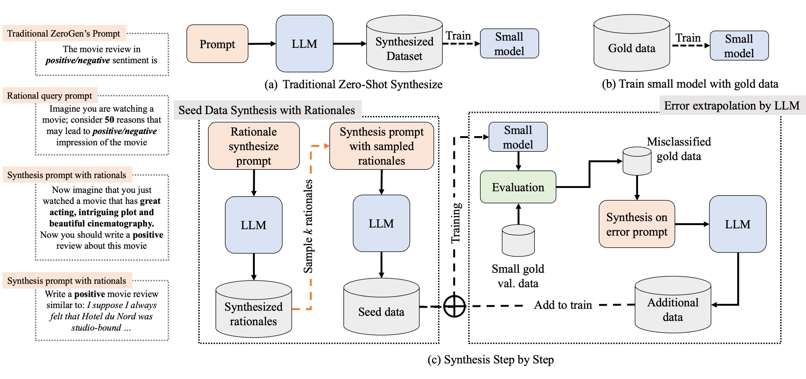

# Synthesis_Step-by-Step_Official

This repository contains the datasets and codes for our paper "Let's Synthesize Step by Step:
Iterative Dataset Synthesis with Large Language Models by Extrapolating Errors from Small Models"



If you use this code, please cite our paper:

```
@misc{wang2023lets,
      title={Let's Synthesize Step by Step: Iterative Dataset Synthesis with Large Language Models by Extrapolating Errors from Small Models}, 
      author={Ruida Wang and Wangchunshu Zhou and Mrinmaya Sachan},
      year={2023},
      eprint={2310.13671},
      archivePrefix={arXiv},
      primaryClass={cs.CL}
}
```

## Datasets

If you just want to explore our dataset. We provide a simple json version of the dataset ``./Datasets``. The format for each 
task is as follows:

1. **IMDb:** The dataset is formatted as: [[Review text], [label]]
2. **QNLI:** The dataset is in format: [[premises], [questions], [labels]]
3. **RTE:** The dataset has format: [[premises], [hypothesis], [label]]
4. **AdQA:** The dataset is formatted as: [[contexts], [questions], [answers], [start_idx], [end_idx], [id]]
